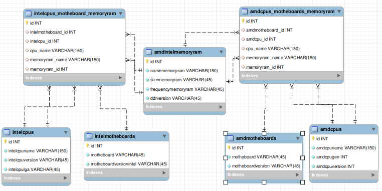

# APIREST-IS-COMPATIBLE

- In the API is compatible we use the following technologies: Javascript with NodeJS, Express, Knex and MySQL database. It controls the entire flow of access to information.
<hr>

## Starting API

- To get started is very simple, first we will run the command:

* npm i

- With that it will download all the dependency packages that are in the package.json, necessary for the project to work 100%.
<hr>

## Database configuration

- The database the database is configured as shown in the schema.

<br>

- the amdcpus_motheboards_memoryram database is responsible for leaving all ram memories from both AMD and INTEL (both may or may not use the same).

### Get /motheboard/AMD

- This endpoint is responsible for returning the list of all motheboards-AMD registered in the database.

#### Parameters

- Nothing

#### Response

##### Ok! > Status 200

- If this is the response returned, it means that everything went well and you will receive the motheboard-amd listing from the bank.
  Example answer:

```
[
    {
        "id": 1,
        "motheboard": "B550 AORUS PRO ELITE 2",
        "motheboardversion": "B550"
    },
    {
        "id": 2,
        "motheboard": "B550 AORUS PRO ELITE 2",
        "motheboardversion": "0"
    },
    {
        "id": 5,
        "motheboard": "B550 AORUS PRO ELITE 2",
        "motheboardversion": "B450"
    }
]
```

<hr>

### Get /motheboard/:id

- This endpoint is responsible for returning the listing of a specific motheboard-AMD through the id.

#### Parameters

- Id dof motheboard in router:
  example:
- http://localhost:4567/motheboard/2

#### Response

##### Ok! > Status 200

- If this is the response returned, it means that everything went well and you will receive the motheboard-AMD listing for that ID.
  Exemplo de resposta:

```
{
    "id": 10,
    "motheboard": "A320 DSh2 Gigabyte",
    "motheboardversion": "A320"
}
```

##### Authentication failed! > status 400

- If this is the response returned, it means that the motheboard was not found.
  Example answer:

```
Not Found
```

<hr>

## Edpoints

### POST AMD_MOTHEBOARDS

- This endpoint is responsible for creating an AMD motherboard via the http://localhost:1952/motheboard/AMD route with the POST method.

### Parameters @EXAMPLE

- motheboard: motherboard name
- motheboardversion: motherboard version, ex: A320, B450, B550...

{
"motheboard": "name motheboard",
"motheboardversion": "B450"
}

#### answer

##### Ok! > Status 200

- If this is the answer returned, it means that everything went well and that the motheboard was registered in the bank.

##### Invalid motherboard name or version! > 400

- If this error occurs, it means that one of the parameters was passed wrong
<hr>

## Edpoints

### POST AMD_MOTHEBOARDS_RELATIONSHIP

- This endpoint is responsible for creating an AMD motherboard via the http://localhost:1952/relationmotheboard/AMD/ route with the POST method.

### Parameters @EXAMPLE

- amdmotheboard_id: id of motheboard
- amdcpu_id: id of CPU
- cpu_name: name of CPU
- memoryram_name: name of memory-ram
- memoryram_id: id of memory-ram

{
"amdmotheboard_id": id,
"amdcpu_id": id,
"cpu_name": "name_of_cpu",
"memoryram_name": "memoryram-name"
"memoryram_id": id
}

#### answer

##### Ok! > Status 200

- If this is the answer returned, it means that everything went well and that the motheboard was registered in the bank.

##### Invalid motherboard name or version! > 400

- If this error occurs, it means that one of the parameters was passed wrong
<hr>

## Edpoints

### PUT AMD_MOTHEBOARDS

- This endpoint is responsible for update an AMD motherboard via the http://localhost:1952/motheboard route with the PUT method.

### Parameters @EXAMPLE

- amdmotheboard_id: id of motheboard
- amdcpu_id: id of CPU
- cpu_name: name of CPU
- memoryram_name: name of memory-ram
- memoryram_id: id of memory-ram

{
"amdmotheboard_id": id,
"amdcpu_id": id,
"cpu_name": "name_of_cpu",
"memoryram_name": "memoryram-name"
"memoryram_id": id
}

#### answer

##### Ok! > Status 200

- If this is the answer returned, it means that everything went well and that the motheboard was registered in the bank.

##### Invalid motherboard name or version! > 400

- If this error occurs, it means that one of the parameters was passed wrong
<hr>

## Edpoints

### DELETE AMD_MOTHEBOARDS

- This endpoint is responsible for delete an AMD motherboard via the http://localhost:1952/motheboard/:id route with the PUT method.

### Parameters @EXAMPLE

- Id of motheboard in router:
  example:
- http://localhost:4567/motheboard/2

#### answer

##### Ok! > Status 200

- If this is the answer returned, it means that everything went well and that the motheboard was deleted in the bank.

##### Invalid motherboard name or version! > 400

- If this error occurs, it means that one of the parameters was passed wrong
<hr>

### CREATE MEMORY-RAM

{
  "namememoryram": "Memória XPG Spectrix D41 RGB - 16GB - 3000MHz",
  "sizememoryram": "16GB",
  "frequencymemoryram": "3000MHZ", 
  "ddrversion": "DDR", 
  "operatingvoltage": "1,35"
}